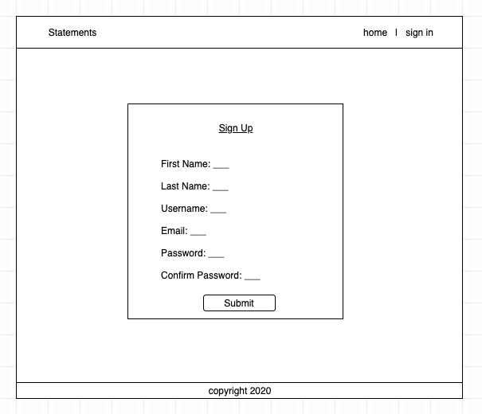
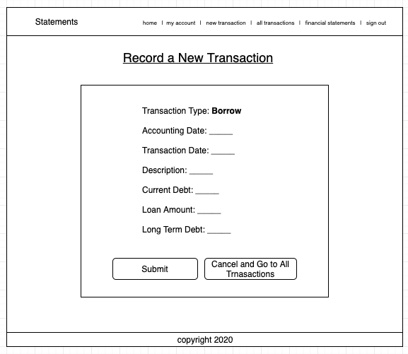
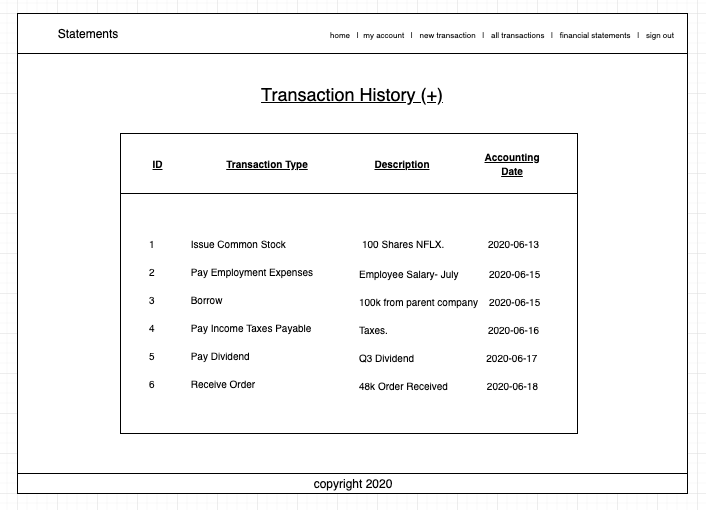
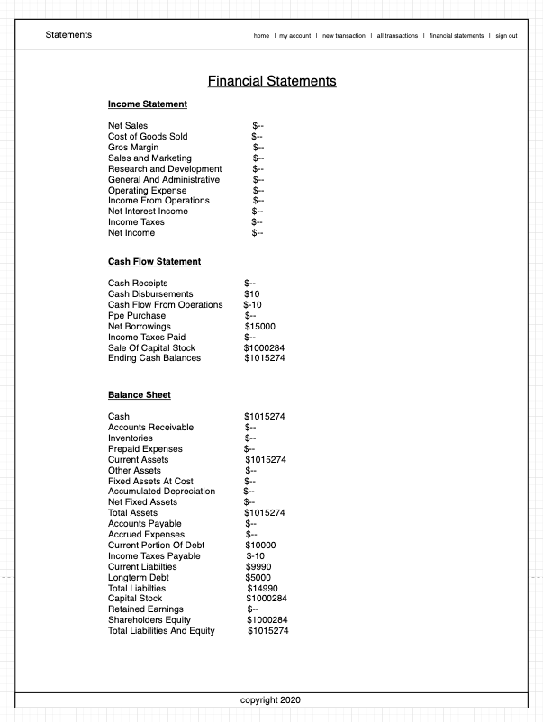
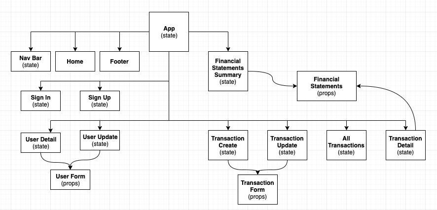

# Statements

## Front-end Readme

## Project Description

This app allows the user to record various types of transactions and generates financial statements that summarize the transaction history.

## Front-End Technologies

- React
- CSS

## Backend Technologies

- Python
- Django
- SQL

## Wireframes

## User Stories

_**MVP User Stories**_

- _As a user, I want to record all of my business' transactions._
- _As a user, I want to be prompted for the required data for each transaction type._
- _As a user, I want to generate a balance sheet that considers all transactions during a year's time._
- _As a user, I want to securely save my financial records so that I may access them when I log in._

_**Post MVP Stretch Goals**_

- _As a user, I want to retrieve a balance sheet for any period of time (monthly, quarterly, annually, all-time)._
- _As a user, I want my investments and long-term debt to automatically rollover into the next calendar year._
- _As a user, I want to review various ratio analyses of my transactions._

## Sample JSON data

[View API Endpoints](endpoints.md)

## React Component Hierarchy

